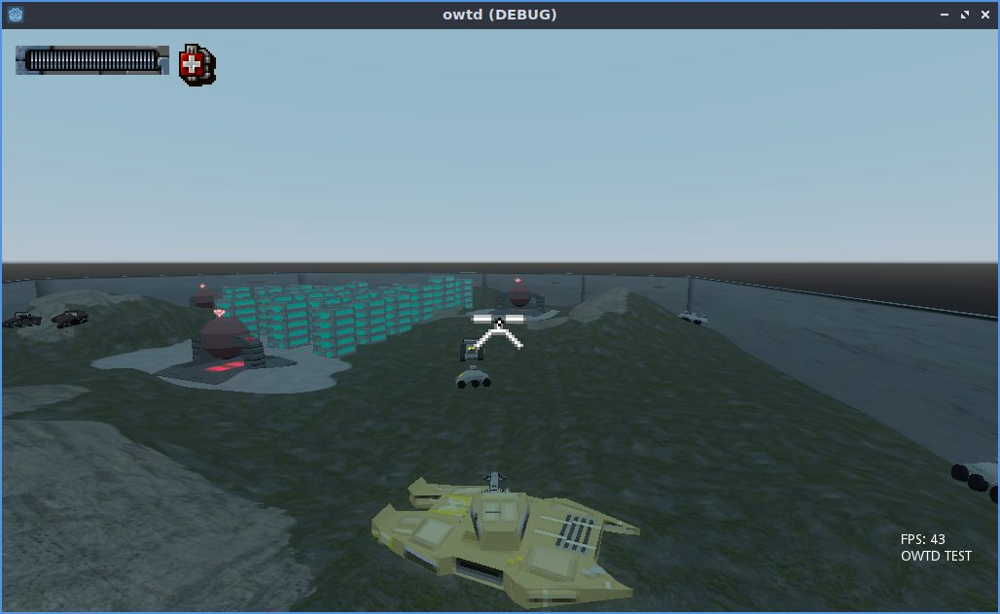

## Hovertank '22

Vehicular combat in godot

[Mapping guide](http://blog.eamonnmr.com/2022/03/making-a-hovertank-level/)

Includes HTerrain and GodotDetour (MIT)

Assets are credited by folder and licensed as noted. My own assets are in the Eamonn folder.

I've built a binary for GodotDetour for Linux and Windows but for other platforms you'll need to build it.

go into godotdetour, set up the native library as described in its docs: https://github.com/TheSHEEEP/godotdetour

WASD to move, mouse aims

